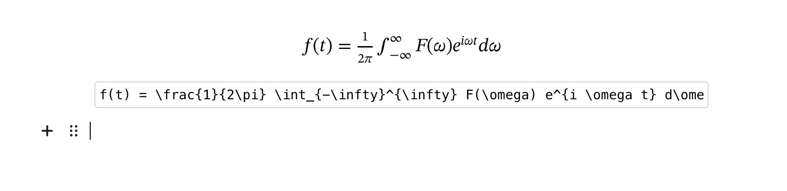

# LaTex Tool

LaTex Block for the [Editor.js](https://editorjs.io).



## Features

- Render LaTex on input.
- Support read-only mode, input field is diabled on read-only mode.
- Allows adding a border, show/hide input filed.
- Allows stretching the preview to the container's full-width

## Installation

Get the package

```shell
npm i editorjs-tool-latex
```

Include module at your application

```javascript
import LaTexTool from 'editorjs-tool-latex';
```

Optionally, you can load this tool from [JsDelivr CDN](https://cdn.jsdelivr.net/npm/editorjs-tool-latex@latest)

## Usage

Add a new Tool to the `tools` property of the Editor.js initial config.

```javascript
import LaTexTool from 'editorjs-tool-latex';

var editor = EditorJS({
  ...

  tools: {
    ...
    math: {
      class: LaTexTool,
        config: {
            features: {
                border: true,
                stretch: true,
                hideInput: true,
            },
        },
    }
  }

  ...
});
```

## Config Params

Latex Tool supports these configuration parameters:

| Field       | Type     | Description                                                                                                       |
| ----------- | -------- | ----------------------------------------------------------------------------------------------------------------- |
| placeholder | `string` | Placeholder for input field                                                                                       |
| features    | `object` | Allows you to enable/disable additional features such as border, background tunes and caption. See details below. |

## Tool's settings

1. Add border to preview section

2. Stretch to full-width

3. Hide input filed

Add extra setting-buttons by adding them to the `actions`-array in the configuration:

```js
actions: [
    {
        name: 'new_button',
        icon: '<svg>...</svg>',
        title: 'New Button',
        toggle: true,
        action: (name) => {
            alert(`${name} button clicked`);
        }
    }
]
```

You can disable features such as border, stretch and hideInput tunes by defining `features` in the configuration:

```js
features: {
  hideInput: true,
  border: false,
  stretch: false
}
```

**_NOTE:_** set caption to `optional` in order to configure caption as a tune.

## Output data

This Tool returns `data` with following format

| Field      | Type      | Description                   |
| ---------- | --------- | ----------------------------- |
| math       | `string`  | raw input value               |
| hideInput  | `boolean` | hide input field              |
| withBorder | `boolean` | add border to preview section |
| stretched  | `boolean` | stretch to screen's width     |

```json
{
    "type": "math",
    "data":
    {
        "math": "f(t) = \\frac{1}{2\\pi} \\int_{-\\infty}^{\\infty} F(\\omega) e^{i \\omega t} d\\omega",
        "withBorder": false,
        "stretched": false,
        "hideInput": false
    }
}
```
